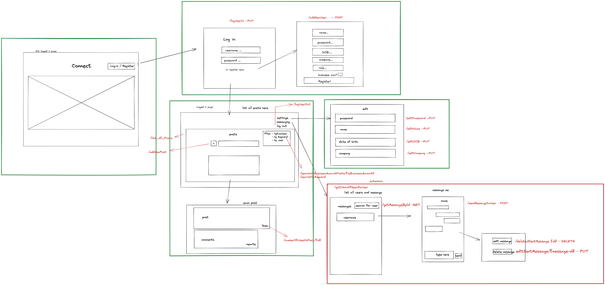

# FakeBook:

This project was bootstrapped with [Create React App](https://github.com/facebook/create-react-app).

Tagline: A Social media platform for young professionals

## Wireframe

Our wireframe for this project is included here: 

## Tech Stack

This project was built using:
- JavaScript with React and Bootstrap frameworks
- HTML
- CSS

## How to start the server: 

As well as dowloading this project, you will need to download and run [this one](https://github.com/JenV1/Social_Media_Back_End) following the instructions on the README there. This is an updated version of [this project](https://github.com/LMBroadhurst/backEndProjectGroup5), for compatability with the front end server.
 
In the project directory, you should first run `npm install` to install required dependencies

Next run `npm start` to start the server

Open [http://localhost:3000](http://localhost:3000) to view it in your browser.

Type `npm run build` to build the app for production to the `build` folder.\
It correctly bundles React in production mode and optimizes the build for the best performance.

See the section about [deployment](https://facebook.github.io/create-react-app/docs/deployment) for more information.

### Using the application: 

Once in the web app you have plenty of functionality at your finger tips: 

#### Landing page

You will start off at the landing page to welcome you to the site. From here you are able to log in and register for Connect.

#### Login & Register Pages

Here you are able to login to an existing user account or register to create a new account, all of this information is saved to the backend database.

#### Feed Page

The main page of the site, allowing you to scroll through the user generated posts, like the posts, add/edit comments as well as, of course, creating your own new content with the option to add posts.

#### Settings Page

On this page you are able to view the profile information of the user currently logged in to the website. There is also the option to edit the profile details, which then saves these changes to the backend database.

### Credit

This project was made by:
- [James Stillman](https://github.com/JStillman1)
- [Jenna Vlahos](https://github.com/JenV1)
- [Katya Grenier](https://github.com/katyagr)
- [Ziqiong Li](https://github.com/Ziqiongg)

#### Acknowledgements 

Group 5 - Lewis Broadhurst, Mohamed Ismail, Cem Gurhan & Scott Christie - for providing the backend project and assisting us in fixing some issues

[Internet icons](https://www.flaticon.com/free-icons/internet) created by Freepik - Flaticon
